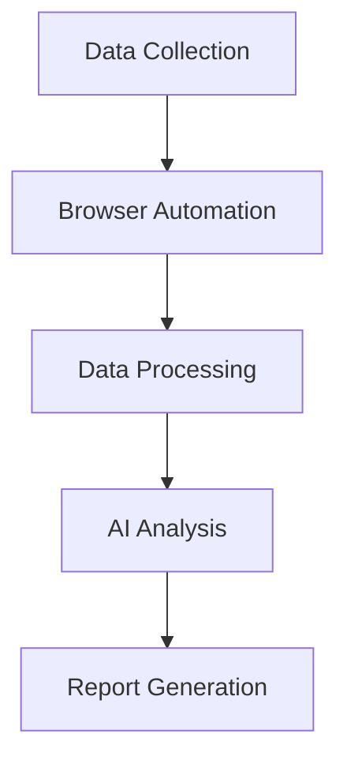

# Crypto Wallet Analysis Agent 🔍

<div align="center">

[](https://opensource.org/licenses/MIT)
[](https://www.python.org/downloads/)

</div>

An AI-powered tool for analyzing Ethereum wallet behavior, transactions, and patterns. Combines browser automation with advanced LLM capabilities to provide comprehensive wallet analysis.

## ✨ Features

- 🤖 **AI-Powered Analysis**: Uses advanced LLMs for pattern recognition and behavior analysis
- 🔄 **Multiple Analysis Modes**:
  - Portfolio composition and value
  - Wallet age and history
  - Transaction patterns
  - Behavioral analysis (bot vs human)
  - Trend analysis
- 🌐 **Multi-Provider Support**: Compatible with:
  - OpenAI (GPT-4, GPT-3.5)
  - Google (Gemini)
  - Anthropic (Claude)
  - DeepSeek
  - Ollama (local models)
- 🎯 **Browser Automation**: Seamless data collection with persistent sessions
- 📊 **Custom Analysis**: Extensible framework for specialized analysis

## 🚀 Quick Start

### Prerequisites

```bash
# Requires Python 3.11+
python --version  # Should be 3.11 or higher

# Clone repository
git clone https://github.com/truong11062002/crypto_wallet_analysis_agent.git
cd crypto_wallet_analysis_agent

# Create virtual environment
python -m venv venv
source venv/bin/activate  # On Unix/macOS
venv\Scripts\activate  # On Windows

# Install dependencies
pip install -r requirements.txt

# Install Playwright
playwright install
```

### Basic Usage

```python
from src.analyzer import EthereumWalletAnalyzer

# Initialize analyzer
analyzer = EthereumWalletAnalyzer()

# Analyze a single wallet
results = analyzer.analyze_single_wallet(wallet_data)

# Save analysis results
analyzer.save_analysis(results, "analysis_results")
```

### Configuration

Create a `.env` file:

```bash
# Copy example configuration
cp .env.example .env

# Edit with your settings
OPENAI_API_KEY=your_key_here
GOOGLE_API_KEY=your_key_here
```

## 📖 Documentation

### Running the Scraper

1. Create input file:

```bash
# wallet_addresses.txt
0x123...
0x456...
```

2. Run analysis:

```bash
# Portfolio Analysis
python scraper.py PROMPT_WALLET_ADDRESS

# Wallet Age Analysis
python scraper.py WALLET_AGE

# Transaction Analysis
python scraper.py TRANSACTIONS_PROMPT

# Behavioral Analysis
python scraper.py BEHAVIOR_PROMPT
```

### Browser Configuration

```python
from browser_use.browser.browser import BrowserConfig
from src.browser.custom_browser import CustomBrowser

browser = CustomBrowser(
    config=BrowserConfig(
        headless=False,
        disable_security=True,
        chrome_instance_path="/path/to/chrome"
    )
)
```

## 🏗️ Architecture



- **Data Collection**: Etherscan scraping with rate limiting
- **Browser Automation**: Playwright-based custom browser
- **AI Analysis**: Multi-provider LLM integration
- **Report Generation**: Customizable markdown reports

## ⚠️ Limitations and Assumptions

### Technical Limitations

1. **Data Collection**

   - Limited to Etherscan's web interface
   - Subject to rate limiting and IP blocks
   - No direct blockchain node access
   - Historical data may be incomplete

2. **Browser Automation**

   - Requires Chrome browser
   - Dependent on Etherscan's UI structure
   - Limited concurrent sessions
   - Memory-intensive for large datasets

3. **Analysis Capabilities**
   - LLM analysis quality varies by provider
   - No real-time transaction monitoring
   - Limited pattern recognition without ML
   - Processing speed constraints

### Core Assumptions

1. **Data Availability**

   - Wallet addresses are valid
   - Transactions are publicly visible
   - Etherscan remains accessible
   - Standard ERC-20 token support

2. **Environment**

   - Stable internet connection
   - Sufficient system resources
   - Compatible Python version
   - Required API keys available

3. **Usage Patterns**
   - Sequential wallet processing
   - Standard browser configurations
   - Reasonable request volumes
   - English language content

## 🎯 Future Work

### Enhanced Analysis

- [ ] Cross-validation with multiple data sources
- [ ] Layer 2 solution support
- [ ] Historical price data integration
- [ ] Machine learning pattern recognition

### Robustness

- [ ] Comprehensive error handling
- [ ] Smart rate limiting
- [ ] Data validation framework
- [ ] Automated testing suite

### Documentation

- [ ] Technical documentation
- [ ] Analysis methodology guides
- [ ] Case studies
- [ ] API documentation

## ⚠️ Limitations

- Relies on Etherscan web interface
- Rate limited by web scraping constraints
- Accuracy depends on LLM model quality
- Requires Chrome browser

## 🤝 Contributing

Contributions welcome! Please read our [Contributing Guide](CONTRIBUTING.md).

## 📜 License

[MIT License](LICENSE)

## 🙏 Acknowledgments

- [browser-use](https://github.com/browser-use/browser-use) for browser automation inspiration
- [phidata](https://github.com/phidatahq/phidata) for project structure inspiration
